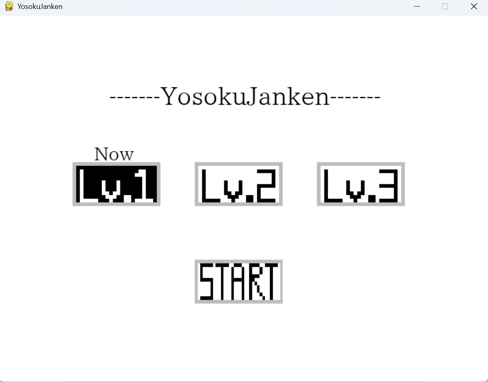
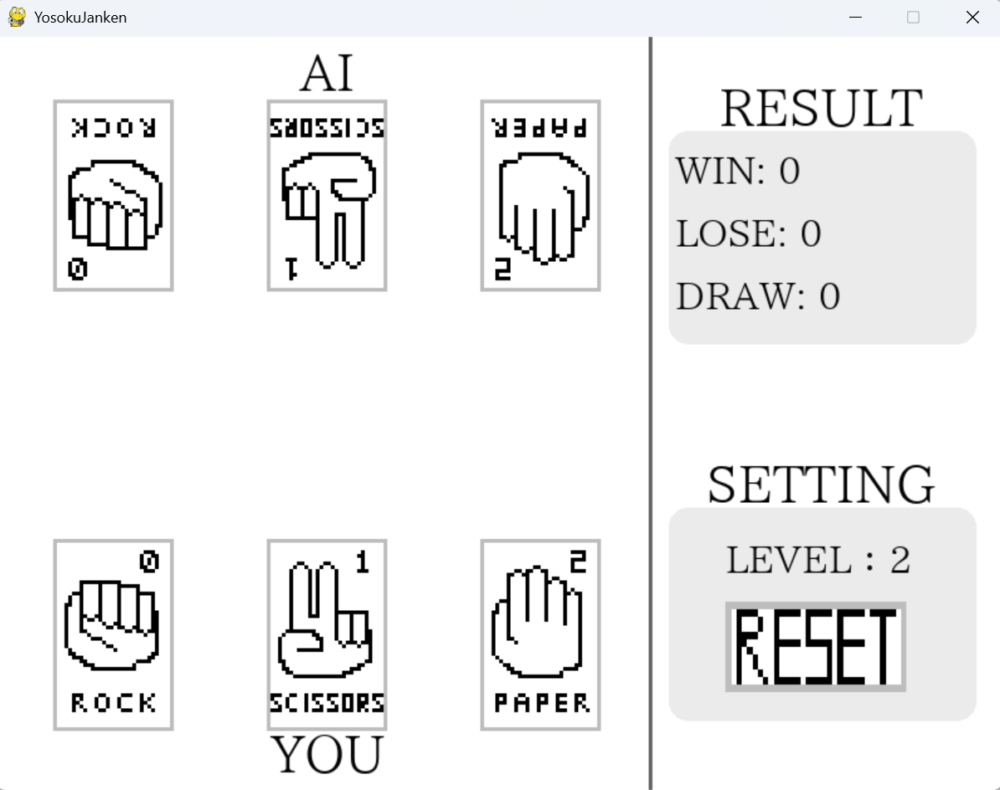
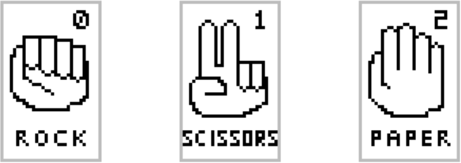
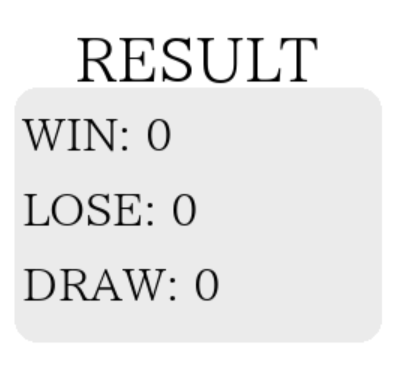
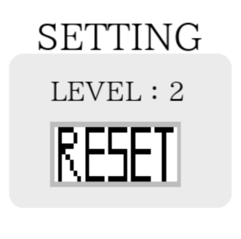

# 予測じゃんけん
## 概要
Pythonのpygameで作成したAIとじゃんけんができるシンプルなゲームです。AIは3つのレベルを選べます。 
.exeファイルのダウンロードは[こちら](https://github.com/Daito-S/yosoku_janken/releases/tag/v1.0.0)

制作時期：2025年12月～2026年1月

## 機能説明
### 遊び方
このゲームはマウスのクリックのみで操作します。

#### 1. タイトル画面

ゲームを起動すると上図のようなタイトル画面が表示されます。ここではAIのレベルの選択とゲームの開始ができます。

お好みでレベルを選んだら下のSTARTボタンをクリックしてじゃんけんを開始してください

---

#### 2. ゲーム画面

ゲームを開始すると上図のような画面になりじゃんけんができます。それぞれの役割は次の通りです。

- 画面左側
    - じゃんけんボタン
    

    じゃんけんでどの手を出すか決められます。マウスがボタンの上にあると枠以外の色が反転し、クリックすると少し前に進みます。 
    (マウスが離れると元に戻ります。)  
    手を決めるとAIもプレイヤーの手を予測して手を出してきます。そして勝負！結果が画面中央に表示され、後述のRESULTの箇所に記録されます。  
    じゃんけんに終わりはありません。「30勝するまでやる」など遊ぶ時に好きなだけじゃんけんしてください。 
    (遊ぶ数が少なすぎるとAIは弱く、場合によっては予測せずランダムで手を出すだけになってしまいます。)

- 画面右側
    - RESULT
    

    じゃんけんの勝敗数が記録されます。レベルごとに勝ち負けの数がどう変わるか注目してみてください。

    - SETTING
    

    AIのレベルを確認できます。また、RESETボタンを押せばタイトル画面に戻れます。 
    (AIの学習もリセットされるので注意！)

---

### AIについて
概要で述べた通りAIには3つのレベルがあります。ここでは、それぞれのAIの仕組みなどについて説明します。

プレイヤーが出した手を見てからAIが手を決定する仕組みではありません。ちゃんとお互い手を出してからプレイヤーの手を学習します。 
また、じゃんけんの一回目あたりはデータが少なすぎてAIがなにも予測できないときもあります。 
そんな時はどうしようもないのでランダムで手を出すようになっています。 => スロースターター気味です。

(AIのレベルによっては完封勝利も狙えたりします。)

---

#### レベル1 
超シンプルな仕組みのAIです。 
プレイヤーが一番多く出した手に勝てるような手を出します。

(例)プレイヤーがグーを一番多く出していると、他の手の数がグーより多くなるまで、AIはパーを出す

---

#### レベル2
マルコフ連鎖を使った仕組みのAIです。 
プレイヤーがある手の次にどの手を出しがちか記録して、前回のプレイヤーの手から今回の手を予測します。

(例)プレイヤーがグーのあとにパーを出しがちと分かっていると、プレイヤーがグーを出した次の回にAIはチョキを出す

---

#### レベル3
N-gram(2-gram)を使った仕組みのAIです。 
レベル2を複雑にしたもので、プレイヤーが二つの手を出した後にどの手を出しがちか記録して、過去2回のプレイヤーの手から今回の手を予測します。

(例)プレイヤーがグー,チョキの順番で手を出したあとにパーを出しがちと分かっていると、プレイヤーがグー,チョキの順番で手を出した次の回にAIはチョキを出す。

レベル2もN-gramであり、レベル3より過去の手をみる数が一つ少ないので1-gramといえます。
